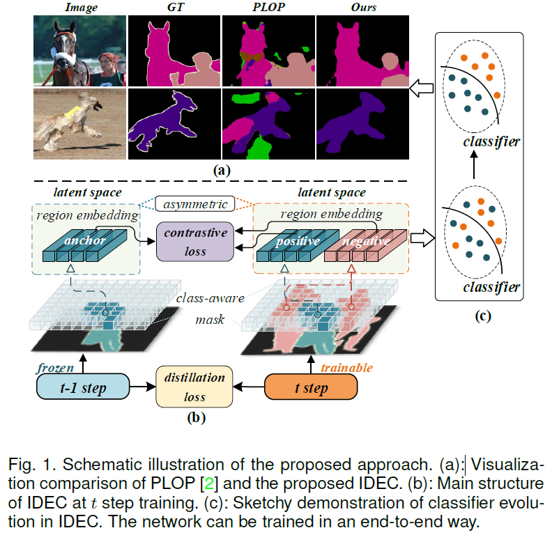
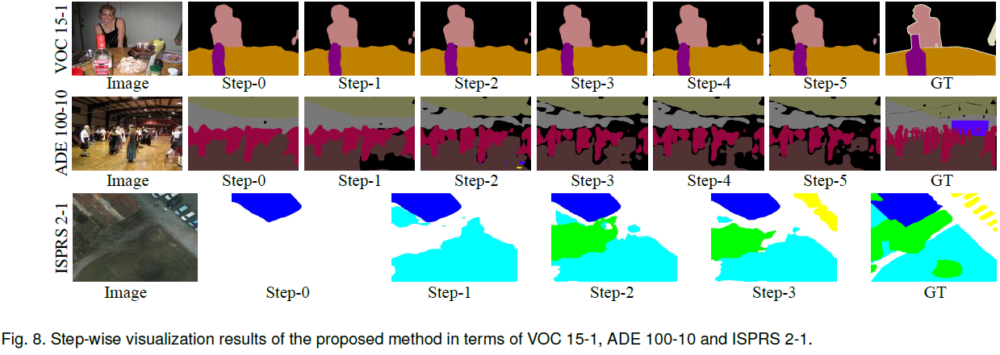

# IDEC
### Inherit With Distillation and Evolve With Contrast: Exploring Class Incremental Semantic Segmentation without Exemplar Memory. 2023.

Danpei Zhao<sup>1,2*</sup>, Bo Yuan<sup>1,2</sup>,  Zhenwei Shi<sup>1</sup>.

<sup>1</sup> <sub>Image Processing Center, BUAA</sub><br />
<sup>2</sup> <sub>Airvic Lab</sub><br />

As a front-burner problem in incremental learning, class incremental semantic segmentation (CISS) is plagued by catastrophic forgetting and semantic drift. Although recent methods have utilized knowledge distillation to transfer knowledge from the old model, they are still unable to avoid pixel confusion, which results in severe misclassification after incremental steps due to the lack of annotations for past and future classes. Meanwhile data-replay-based approaches suffer from storage burdens and privacy concerns. In this paper, we propose to address CISS without exemplar memory and resolve catastrophic forgetting as well as semantic drift synchronously. We present Inherit with Distillation and Evolve with Contrast (IDEC), which consists of a Dense Knowledge Distillation on all Aspects (DADA) manner and an Asymmetric Region-wise Contrastive Learning (ARCL) module.  Driven by the devised dynamic class-specific pseudo-labelling strategy,  DADA distils intermediate-layer features and output-logits collaboratively with more emphasis on semantic-invariant knowledge inheritance. ARCL implements region-wise contrastive learning in the latent space to resolve semantic drift among known classes, current classes, and unknown classes.
We demonstrate the effectiveness of our method on multiple CISS tasks by state-of-the-art performance, including Pascal VOC 2012, ADE20K and ISPRS datasets. Our method also shows superior anti-forgetting ability, particularly in multi-step CISS tasks. 


### Update 2023-08-02

## Results


## pretrained models

| Task        | Total IL steps   | model 
|-------------|---------|-----------
| VOC 15-5    | 2       | link    
| VOC 15-1    | 6       | [BaiduYun](https://pan.baidu.com/s/1zvusmhzKrCWQDPnUKQnZCQ)[fetchcode: 6lc3]  [GoogleDrive](https://drive.google.com/drive/u/0/folders/1JHQYep21cWuK97HX2xWLf9QacG3HQVCs) 
| VOC 5-3     | 5       | link    
| VOC 10-1    | 11      | [BaiduYun](https://pan.baidu.com/s/1h4UYJcRtD_Kzz0OWAHOtig)[fetchcode: 55ld]  
| ADE 100-50  | 2       | link 
| ADE 100-10  | 6       | link   
| ADE 50-50   | 3       | link  
| ADE 100-5   | 11      | link   
| ISPRS 4-1   | 2       | link    
| ISPRS 2-3   | 2       | [BaiduYun](https://pan.baidu.com/s/14_-FFm-O2Rz_3Mqt4ls5Wg)[fetchcode: vxge]    
| ISPRS 2-2-1 | 3       | [BaiduYun](https://pan.baidu.com/s/1jYQlj9x-VadharG9RVdjeg)[fetchcode: snz4]  
| ISPRS 2-1   | 4       | [BaiduYun](https://pan.baidu.com/s/1qPz1XqgIBkYW92-Zh6ZUcA)[fetchcode: h8st]    

More on the way.

## Inference
```sh inference.sh```

## Train
```sh run.sh```

## License
©2022 Airvic *All Rights Reserved*


